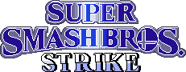

# Super Smash Bros. Strike
A Super Smash Brothers fangame for the Nintendo DS.<br>

<br>I've loved the Nintendo DS since I was a child, and always wondered why there was no smash bros game for it. Now that I have the ability to code and make art, I want to give it a try<br>

<br>This project is a work in progress and is not affiliated with Nintendo. Its purpose is to imagine a hypothetical Smash Brothers game on the Nintendo DS that would been released in 2009<br>

<br>
If you want to make a suggestion be sure to open a pull request, If you want to contact me , send a dm trough discord<br>
<br>


### Disclaimer
This project is not affiliated with Nintendo or the Official Super Smash Bros. in any way. It is a fan-made project and is not intended for commercial use. All assets used in this project are use for educational and entertainment purposes only.

## Installation:
You can compile the game yourself but a build will always be in the releases.
Please check the Tested devices part before starting.<br><br>
[](https://github.com/Masherzn/SSB-STRIKE/releases)

### Tested devices:
| System                           | Functionality             | Cons                  | Notes                                                                                                       |
|----------------------------------|---------------------------|-----------------------|-------------------------------------------------------------------------------------------------------------|
| Nintendo DSi (XL) (TM++)         | Excellent                 | None                  | Make sure to set launcher as Default                                                                 |
| Nintendo 3DS (New) (XL) (TM++)   | Excellent                 | None                  | Make sure to set launcher as Default    |
| Flashcarts (DS/DS Lite/DSi)      | Not tested yet            | Not tested yet        | Will probably need to be DLDI patched |
| NO$GBA (Windows Emulator)        | Medium                    | Backgrounds jitter and can have some graphical issues |                                       |
| desMuMe (Windows Emulator)       | Medium            | Backgrounds jitter and can have some graphical issues |                                                                             |
| melonDS (Windows Emulator)       | Excellent            | None              |  |


## Gameplay:
- X/Y: Jump 
- Directional pad: Move
- L/R: Zoom in/Zoom out
- X/Y: Switch items
- Start: Reset Zoom
- A: Attack
- B: Special


### Version 0.0 ([Download](https://github.com/AzizBgBoss/TerrariaDS/releases/tag/0.0alpha)):
Initial commit with basic project structure.
- Sprite and Background rendering. ***(done)***
- Zoom in / Zoom out Feature. ***(done)***
- Animation system. ***(partially done)***
- Player structure and movement. ***(partially done. needs improvements)***
- SFX and music. ***(done)***

### Version 0.1 (Coming soon):
- Add dynamic camera (following characters)
- Add Damage percentage and bottom screen HUD.
- Add custom stage collisions.
- Add hitbox / hurtbox system


## Plans for the future:
- Multiplayer support.
- Alternative Colors
- Stage Creator
- Records and trophies
- Extra content and features for the DSi.


## Compile it yourself
To compile this project, you need to have BlocksDS installed. You can find instructions on how to install it on the [devkitPro website](https://blocksds.skylyrac.net/docs/)

Once you have devkitPro installed, you can clone this repository by running:
```bash
git clone https://github.com/MasherZN/SSB-STRIKE.git
```

Then, navigate to the project directory:
```bash
cd SSB-STRIKE
```

For good measure, clean the place first:
```bash
make clean
```

Now, you can compile the project by running:
```bash
make
```
This will create a `ssbds.nds` file in the root directory of the project.

## Credits
- Masherzn (Director, Coder and Spriter)
- RustysJunk, Jaymz (Spriters and Concept Artists)
- "DS(i) Mode Customization!" Discord Server
- Headshotnoby (coder, mp3 decoder) 
- AntonioND (Helped me a lot understanding gl2d) 
- Nintendo
- AzizBgBoss

## Screenshots:
.png)
.png)
.png)
.png)
.png)
.png)
.png)
